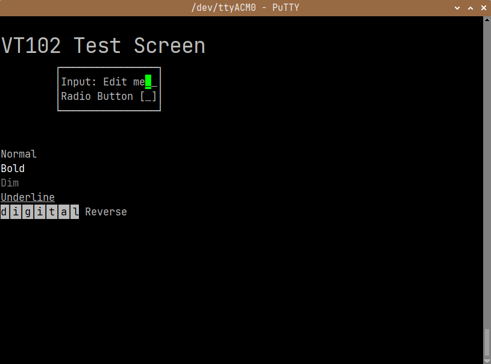

# pico_vt100_input
CircuitPython vt100 input interface thing.

I needed a better vt100 text interface to a Raspberry Pico with CircuitPython. 
So made sort of a "micro ncurses" interface.

In the `lib` directory you'll find:

 * vt100.py, a convenience code block defining VT100 sequences and key
definitions.
 * edittextfield.py, a class handles text and radio button input. Allowing 
cursor key movement within the textfield and delete key functionality.

In the root directory you will find `code.py` which is an example
implimentation. Shows how to make an input dialog and change input focus using
the TAB and Shift-TAB. Radio button state is toggled with the spacebar. The
dialog is exited with Enter, which returns True, or ESC which returns False.
  